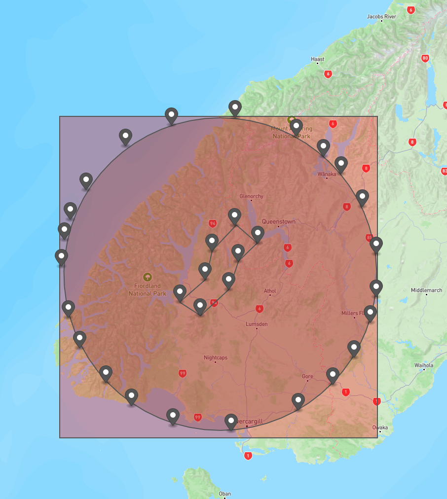

# Bounding Box

A bounding box of a set of points $P$ in two-dimensions is a rectangle that encloses the
points. The rectangle may be rotated. The following coloured rectangles are
all examples of a bounding box:

While a set of points may have many bounding boxes, there are two that are most often used:

1. A _minimum area bounding box_. This is a bounding box that has the smallest
possible area. These are not necessarily unique.
2. An _axis-aligned minimum area bounding box_. This is a bounding box that
has the smallest possible area, _and_ whose sides are parallel to some
two-dimensional axes. For a given axes, axis-aligned minimum area bounding boxes are unique.

Considering the earlier example we can see the minimum area bounding box
(in green), and the axis-aligned minimum area bounding box (in red) for the
axis indicated in the bottom left. Notice that the axis-aligned minimum area
bounding box is often considerably larger than the minimum area bounding box.

To see a pathological example where a minimum area bounding box is not
unique, consider the task of bounding a circle. Here any square whose four
sides are tangent to the circle will be a minimum area bounding box.

We use bounding boxes in two places commonly within the simulation pipeline:
1. In the construction of regions for plotting faults in _gmt_. Here you
start with an axis-aligned (with respect to latitude and longitude) bounding
box and typically pad it a little bit on each edge.
1. In determining the bounds of the velocity model, which must be a rectangle,
but which can be rotated. Here we are trying to completely minimise the area
because the bounds of the velocity model are also the simulation bounds. 
The larger the velocity model, the more computationally expensive the simulation is.
Typically, the bounds of the velocity model must include the fault geometry
plus a radius of interest for simulation, but otherwise are cut down as
small as they can be.

We will now describe the algorithms to find the bounding boxes in both cases.

# Axis-Aligned Bounding Box
Finding an axis-aligned bounding box is very simple. First, we find the
minimum and maximum x and y values of the point-set with respect to the
chosen axis. Then, the axis-aligned minimum area bounding box is simply the
box with corners
$$\{(x_{\text{min}}, y_{\text{max}}), (x_{\text{max}}, y_{\text{max}}), (x_{\text{max}}, y_{\text{max}}), (x_{\text{min}}, y_{\text{min}})\}.$$
# Minimum Area Bounding Box
Finding a minimum area bounding box is considerably trickier. The most
efficient algorithms use the rotating callipers method. We do not use this
method, and sacrifice speed for a conceptually simpler algorithm. The central
observation is this: the minimum area bounding box has an edge parallel with
a side of the convex hull. To see this consider the following point cluster:

The _convex hull_ is the minimum area polygon that encloses all the points in the cluster.

To find the minimum area bounding box we first find the convex hull of these
points (with scipy), and then we create a bunch of transformed point sets, that
are rotated so that each segment is _flat_ with respect to the standard axes.

To actually perform the rotation, we calculate the angle of each edge of the
convex hull, and then rotate the set of points by multiplying each with the
[2-D rotation matrix](https://en.wikipedia.org/wiki/Rotation_matrix) for this angle.
For each of these rotated point sets, we create an axis-aligned minimum area bounding box.

The minimum area bounding box is then taken as the smallest bounding box
by area among this set. This box is then rotated back to match the original
input. This is precisely the green box in this image.

# Finding Velocity Model Bounds
The old approach to finding the domain of the velocity model was very complicated. It
involved first guessing a decent velocity domain, and then optimising the
domain by rotating it and shrinking it to increase the proportion of land
usage whilst still including all the fault geometry, and including a minimum
radius $rrup$ from the centre of the fault for observation.

This approach is not ideal for a couple of reasons:

1. It relies on bespoke optimisation algorithms whose correctness is
questionable, and that are very difficult to maintain and improve. The
measure of how bad this gets is that the code isn't even guaranteed to terminate and
must be turned off sometimes because it is too brittle.  
1. It isn't very flexible. If the fault geometry changes (for example,
if we use type-5 multi-segment ruptures), then the old VM domain generation code will
immediately break because it is hard coded to work with a single fixed fault
segment. If we decide to add additional constraints to the 
domain generation (for example, we want to ensure that a certain city is
present in a simulation domain), then the VM code absolutely cannot make
this happen.

The new approach aims to fix both these problems by relying on a completely
standard approach, using well-known algorithms, and a flexible implementation.

We can think of the domain generation problem as that of a minimum area bounding box problem. We want to find the smallest rectangle such that:

1. The fault geometry is completely included;
2. An area of interest (for example, a radius around the centre of geometry)
is included _where this area of interest is on land_. We are not interested
typically in simulating large areas of water, even if these might be within
the radius from the centre of the fault geometry.

To translate this into a minimum area bounding box problem, we need to
identify a set of points that encodes the above two constraints. We will
understand how with a hypothetical example, where we are tasked with finding
a domain for the following simulation:

Our end goal is to help us understand why the code `minimum_area_bounding_box_for_polygons_masked(must_include=fault_geometry, may_include=site_radius_circle, mask=new_zealand_land_outline)` solves the VM domain problem accounting for both points one and two.

The first constraint, _the fault geometry is completely included_, is simple
to accomodate. We simply need to make sure that the set of points we bound
starts with the corners of the fault geometry.

The second constraint is a little trickier. If we simply approximate the circle by a bunch of points, we're going to end up with bounding boxes that are altogether too large.

The reason this simple approach fails is it doesn't account for the ocean and land outline. This problem is what ultimately drove the original implementation to the complicated optimisation problem. 
However, we can instead modify our constraint. Namely, we can look to include the intersection of the circle and the New Zealand land outline. So we instead bound a points like this:

This is what
`minimum_area_bounding_box_for_polygons_masked(must_include=fault_geometry,
may_include=site_radius_circle, mask=new_zealand_land_outline)` will
do. It constructs a set of points to include in the domain: all of the
fault geometry (which must be included), and the intersection of the
`site_radius_circle` (which may be included) with the outline of New Zealand.
It then finds the minimum area bounding box using the algorithm outlined
[earlier](https://github.com/ucgmsim/qcore/wiki/BoundingBox#minimum-area-bounding-box).
If the result looks bigger in the above picture, it's only because I drew
the bounding box by hand. This approach has a lot to like over the old approach:

1. It is simpler, we are just finding a minimum area bounding box of a set
of well-chosen points. The algorithm to do this is well-understood, and its
characteristics are well-known. We shouldn't need to disable the optimisation
as often.
1. We can make guarantees about the velocity domain. We know, for example,
that the domain can never be larger than the axis-aligned bounding box
domain. The box chosen is close to the optimal land usage, because it is
the _minimum area_ box that includes points we must have in the domain. If
the old approach produces smaller domains, it is because it is not including
some of these points.
1. We can easily extend this approach with more constraints. If we wanted
to ensure that Dunedin was present in the simulation we simply add a circle
around Dunedin to the `may_include` option. This kind of flexibility was
not present in the old model, and required one to disable the optimisation
and manually specify the bounds.

