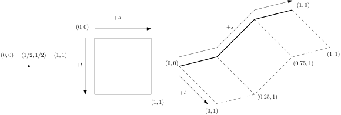

# Sources in QCore

A number of packages need to deal with fault geometry including:

- **Pre-processing**: Where fault geometry is used extensively to
  compute fault discretisation and plane rupture propagation (in
  type-5).
- **Velocity Model**: Where fault geometry is used to help approximate
  the bounds of a suitable velocity model domain.
- **Visualisation Tools**: Where fault geometry is plotted to help
  visualise ruptures or GMM model outputs.

Over and over again we keep defining common routines for working with the geometry, answering questions like:

1. How do I find the corners of a fault?
2. What are the closest points between two faults?
3. How do I compute an evenly spaced set of grid points along a fault?
4. What is the _insert property of fault plane here (dip\_dir, strike, dip, ...)_ of this fault?

The constant redefinition and re-implementation leads to needless
repetition, bugs, and outdated assumptions. Examples of such
assumptions and mistakes include:

1. Always assuming dip direction is 90 degrees from strike (it isn't in NSHM2022!), and
2. Always assuming the top depth of the fault is zero.

The constant repetitive definitions, and the differing locations we
implement fault geometries begs for an implementation of source
geometry that we can all agree on in a central location. This is the
aim of the `qcore.sources` module.

## Design Aims of the Sources Module

The goal of the `qcore.sources` module is to provide a Pythonic
interface to source geometry. It must be general to accommodate new
kinds of sources, and it should not depend on naming conventions that
can change (type-I, type-II, etc). The definition should minimise
parameter redundancy. That is, instead of providing strike, dip,
length, width, bottom, top, we should let as many parameters as
possible be derived. The bottom and top depth values for example, can
be derived from strike, dip, length, and width values. In fact, all
the essential parameters can be found ideally from the supplied
corners of a fault plane in three dimensions. The fault corners, rather than the standard centroid-dip-strike-length-width-... specification we have use in the past, will now be the privileged information defining a fault. Everything else will be measured from the definition of the corners. This has a number of advantages over the old approach:

1. It completely minimises parameter redundancy, and ensures that all
   the paramaters are geometrically consistent. It will now be
   impossible, for example, to specify a plane with inconsistent
   length, width and depth parameters since these will be derived from
   the corners of the fault.
2. Using corners allows us to frame problems of fault geometry as
   problems in linear algebra. The advantage of this is that we can
   take advantage of the wealth of tools available in numpy, scipy,
   etc. In the past, we would write functions like `geo.ll2gp` and do
   everything without any vectorisation. In the future we can use
   matrix transformations to manipulate faults in an efficient and
   concise manner.
   
We also refrain from using inheritance hierarchies and factories to
define sources, instead using simple dataclasses and duck-typing. This
approach more closely matches Python development standards than, for
example, factories and other gang-of-four style patterns common to
Java. Accordingly, there is no Source superclass, and instead a
Protocol (like an interface) that defines the functions that should
exist for any object to be considered a source geometry.

## What Is a Source Geometry?

A *source geometry* is an object with two properties:

1. A geometric definition of its bounds. For a fault plane, this is its corners, for a point-source the bounds are the point itself.
2. A _local coordinate system_. This local coordinate system is
   essential for finding points inside the fault. EMOD3D has its own
   definitions of fault-local coordinates, for example, which we pass
   as `shyp` and `dhyp` parameters to `genslip` and friends.
   
Note that this definition does not require the geometry to be flat
like a plane, or connected, or anything. It is simply a closed and
bounded region with coordinates. The choice of a general definition is
to allow for the flexible addition of sources to this framework, such
a rough surfaces.

## Sources Used in Ground Motion Simulation

While we have five types of sources (per [Source Modelling for GMSim](https://wiki.canterbury.ac.nz/display/QuakeCore/Source+Modelling+for+GMSim)), there are essentially only three source geometries we work with:

1. **Point Source Geometry**: This is a 0-dimensional geometry consisting of a single point. The `qcore.sources` module uses the `Point` class to model the source geometry for a point.
2. **Plane Geometry**: This a 2-dimensional source geometry consisting of a single plane. The extents of the geometry are its corners. The `qcore.sources` module uses the `Plane` class to model single plane geometry.
3. **Multi-Planar Geometry**: This is a 2-dimensional source geometry consisting of a number of connected planes. The extents of the geometry are the corners of the end fault planes. The `qcore.sources` module uses the `Fault` class to model multi-planar geometry.

Type-I fault are an instance of the the first geometry, type-2 faults
are plane geometries, and type-4 and type-5 are multi-planar
geometries.

Note that the term *2-dimensional* here refers to the dimensions of
the local coordinate system, rather than their appearance as
"flat". Both planar and multi-planar geometry are 2-dimensional
because they can be given a local coordinate system with only two
parameters $(s, d)$, where $s$ is length along the strike direction
and $d$ length along the dip direction. Points are 0-dimensional
because their local coordinate system is just a single point.



To make the source module easy to use, we have elected to normalise
all the coordinate systems so that the coordinate systems are always
points $(s, d)$ where $0 \leq s \leq 1$ and $0 \leq d \leq 1$. Note
that this means the boundary of any geometry always corresponds to the
same set of points $\{(0, t)\,|\, 0 \leq t \leq 1\} \cup \{(s, 0)\,|\,
0 \leq s \leq 1\} \cup \{(1, t) \,|\, 0 \leq t \leq 1\} \cup \{(s,
1)\,|\, 0 \leq s \leq 1\}$.


Sources defined in `qcore.sources` will have two methods for converting back and forth between fault local and global coordinate systems:

1. `fault_coordinates_to_wgs_depth_coordinates`: Going from fault-local coordinates to global coordinates.
2. `wgs_depth_coordinates_to_fault_coordinates`: Going from global
   coordinates to fault-local coordinates **if the global coordinates
   lie in the source geometry**. Sources will raise a `ValueError` if
   the supplied coordinates are not in the domain.

For functions that expect these coordinates to exist, the
`HasCoordinates` Protocol class allows you to require the existence of
these methods without specifying a superclass.

```python
def minimum_depth(source: HasCoordinates) -> float:
    return sp.optimize.minimize(
        lambda x: source.fault_coordinates_to_wgs_depth_coordinates(x)[2],
        np.array([1/2, 1/2]),
        bounds=(0, 1)
    )
```

## Answering Geometry Questions with the Sources Module

Below is a kind of cookbook demonstrating how to use the new sources module to answer source geometry questions. 

Q: How do I find the corners of a geometry?

A: Assuming your geometry has corners (which it may not, if the geometry is rough), then the corners can be found simply as 

```python
source = Plane(...) # Or FaultPlane, or even Point!
corners = source.fault_coordinates_to_wgs_depth_coordinates(np.array([
    [0, 0], # top left
    [1, 0], # top right
    [1, 1], # bottom right
    [0, 1]  # bottom left
]]))
```

Q: How can I find the basic parameters of the geometry (strike, dip, rake, etc.)?

A: A `Plane` source has these defined as properties computed from the corners you supply to construct the source
```python
plane = Plane(...)
strike = plane.strike
dip = plane.dip
dip_dir = plane.dip_dir
length = plane.length
length_metres = plane.length_m
```
For some geometries, some of these values are not going to be
well-defined (what is the strike of a multi-planar geometry when it
changes?).

Q: How can I discretise my geometry into a number of evenly spaced points?

A: Here fault-local coordinates really shine because they make discretising sources extremely trivial:
```python
complicated_fault_geometry = FaultPlane(predefined_corners)
# define a meshgrid of points, 50 along the strike and 100 along the dip.
xv, yv = np.meshgrid(np.linspace(0, 1, num=50), np.linspace(0, 1, num=100))
fault_local_meshgrid = np.vstack([xv.ravel(), yv.ravel()])
# Convert the fault local coordinates into global coordinates
global_point_meshgrid = (
     complicated_fault_geometry.fault_coordinates_to_wgs_depth_coordinates(
         fault_local_meshgrid
     )
)
```

Q: How can I find the closest points between two fault geometries?

A: Again, having a local coordinate system turns this into a simple problem. Here is the straight-forward implementation of closest points in the `qcore.sources` module:

```python
source_a = ... # some source geometry like FaultPlane
source_b = ... # some source geometry like Fault

def fault_coordinate_distance(fault_coordinates: np.ndarray) -> float:
    source_a_global_coordinates = (
        source_a.fault_coordinates_to_wgs_depth_coordinates(fault_coordinates[:2])
    )
    source_b_global_coordinates = (
        source_b.fault_coordinates_to_wgs_depth_coordinates(fault_coordinates[2:])
    )
    return coordinates.distance_between_wgs_depth_coordinates(
        source_a_global_coordinates, source_b_global_coordinates
    )

res = sp.optimize.minimize(
    fault_coordinate_distance,
    np.array([1 / 2, 1 / 2, 1 / 2, 1 / 2]),
    bounds=[(0, 1)] * 4,
)


# Now the res.x value contains four elements
# [ s_a, d_a, s_b, d_b ]
# where (s_a, d_a) and (s_b, d_b) are the fault-local coordinates of
# the two closest points between source_a and source_b.
```
